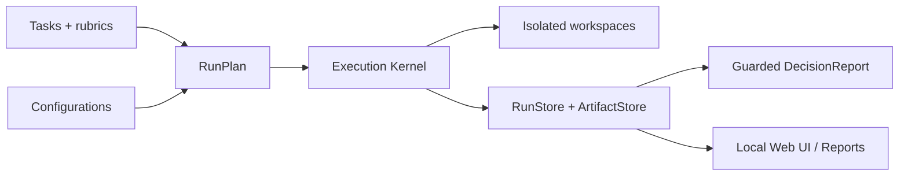

# micro-eval

[English](README.md) | [简体中文](README.zh-CN.md)

[](https://www.python.org/)
[](LICENSE)
[](VERSION)
[](docs/engineering/security-guidelines.md)

Current version: `0.1.3`

**A local-first Agent / Skill evaluation assistant for small AI teams that need evidence, not vibes.**

`micro-eval` turns “the candidate feels better” into a reproducible comparison: the same tasks, the same starting point, the same evidence chain, and a guarded decision about where a baseline or candidate is stronger, weaker, inconclusive, or not comparable.

The current MVP focuses on local pairwise and matrix-style evaluation. It owns the execution layer for subprocess orchestration, bounded concurrency, timeouts, workspace isolation, run storage, artifacts, and reports. Scoring and observability integrations can be attached later; DeepEval is not the test runner, and Langfuse/OpenHands are not hard dependencies for the MVP path.

## Why micro-eval?

Small AI engineering teams often compare prompt, skill, agent, or tool changes with manual impressions. That breaks down when runs are flaky, starting states differ, artifacts disappear, or the UI makes a stronger claim than the evidence supports. `micro-eval` keeps the evaluation loop local and auditable:

- Define tasks and configurations in YAML.
- Expand `tasks × configurations × repetitions` into a canonical run matrix.
- Run local agent CLIs through argv-only subprocess invocations.
- Preserve stdout, stderr, generated artifacts, validation evidence, and human evaluation notes.
- Downgrade decisions when snapshots, evidence, or sample size do not justify a strong claim.

## Features

- **Canonical configuration matrix**: `tasks × configurations × repetitions` expands into `RunPlan` / `RunCell` records.
- **Self-owned execution layer**: asyncio bounded concurrency, per-cell timeout, and non-blocking cell failures.
- **Safe subprocess contract**: canonical `agent.command` is an argv list; legacy string commands only pass through a migration bridge with warnings.
- **Same-start evidence**: `SameStartSnapshot`, `CellSnapshot`, `SnapshotGateResult`, and `ReplayCanonical` are persisted with the run.
- **Workspace isolation**: `blank`, `files`, and `git_repo` workspaces run each cell in an assigned workspace.
- **Artifact / evidence chain**: `.micro-eval/runs/{run_id}/manifest.json` indexes `ArtifactRef` and `EvidenceItem` records.
- **Deterministic validation**: supports `exit_code`, `contains`, `file_exists`, and argv-only `command` expectations.
- **Human evaluation persistence**: the UI appends human `EvaluationResult` records through the local API; `localStorage` is not treated as trusted evaluation state.
- **Guarded decisions**: snapshot mismatch, missing evidence, or insufficient repetitions produce caveats instead of fake winner claims.
- **Local UI/API**: a Next.js UI reads canonical run, cell, artifact, evaluation, and decision data through zod schemas.

## Quick Start

### Prerequisites

- Python 3.11+
- [`uv`](https://docs.astral.sh/uv/) for local Python environment and command execution
- Node.js/npm only when you want to run the source-checkout Web UI

Install from a source checkout:

```bash
git clone https://github.com/xiaozhenliu/micro-eval.git
cd micro-eval
uv sync --all-extras
cd ui && npm install && cd ..
uv run micro-eval --help
```

From an evaluation project directory, create and run a starter evaluation. If you have not installed the CLI into your active environment, replace `micro-eval` with `uv run --project /path/to/micro-eval micro-eval`.

```bash
micro-eval init --force
micro-eval validate
micro-eval run --max-concurrency 2
micro-eval list
micro-eval report --format text
micro-eval report --format html --output report.html
micro-eval ui --port 3000
```

In the Web UI, follow: Run List → Decision Summary → Result Matrix → Cell Evidence → Artifact Viewer → Human Evaluation → Decision/Caveats.

### Ready-to-run example

Use the repository example when you want a complete MVP flow without writing your own `eval.yaml`, task, or fixture workspace:

```bash
# From the repository root
uv run micro-eval validate --config examples/agent-codefix-showdown/eval.mock.yaml
uv run micro-eval run --config examples/agent-codefix-showdown/eval.mock.yaml --max-concurrency 1

# list/report read the current directory's .micro-eval/runs store
cd examples/agent-codefix-showdown
uv run --project ../.. micro-eval list
uv run --project ../.. micro-eval report --format text
uv run --project ../.. micro-eval report --format html --output report.html
```

The real-agent matrix in [`examples/agent-codefix-showdown/`](examples/agent-codefix-showdown/) covers Claude Code, Codex CLI, OpenClaw, and Hermes. The example index is in [`examples/`](examples/).

## CLI Commands

Config lookup order is `--config` → `$MICRO_EVAL_CONFIG` → `./eval.yaml`.

| Command | Purpose |
| --- | --- |
| `micro-eval init [--force]` | Generate a canonical `eval.yaml`, `tasks/hello.yaml`, and starter task templates. |
| `micro-eval validate [--format text\|json]` | Load config/tasks, build the RunPlan, and print actionable diagnostics without running agents. |
| `micro-eval run [--config eval.yaml] [--max-concurrency N] [--dry-run] [--format text\|json]` | Execute the matrix run or print the RunPlan. |
| `micro-eval list [--format text\|json]` | List `.micro-eval/runs/*/run.json` records. |
| `micro-eval report [--run RUN_ID] [--format text\|json\|html]` | Render the matrix, Basic Honest Stats, decision/caveats, and artifacts. |
| `micro-eval ui [--port 3000]` | Start the local Next.js UI from a source checkout. |

## Configuration and Tasks

New projects should use canonical `configurations[]`; legacy `baseline` / `candidate` config files still load through an explicit migration bridge.

A minimal config declares configurations, tasks, guardrails, and evaluation policy:

```yaml
project_name: demo-agent-eval
configurations:
  - id: baseline
    role: baseline
    repetitions: 1
    agent:
      command: ["cat"]
      input_mode: stdin
      output_mode: stdout
      timeout_s: 10
  - id: candidate
    role: candidate
    repetitions: 1
    agent:
      command: ["cat"]
      input_mode: stdin
      output_mode: stdout
      timeout_s: 10
tasks:
  - tasks/hello.yaml
guardrails:
  max_concurrency: 2
  timeout_s: 30
evaluation:
  comparison_subject: "candidate vs baseline"
  min_repetitions: 1
  required_evaluators: [validator]
```

A task describes input, expectations, workspace, and optional rubric metadata:

```yaml
id: hello
name: Hello echo
input_payload: "Hello, micro-eval!"
expectations:
  - type: contains
    stream: output
    value: "Hello, micro-eval!"
workspace:
  type: blank
rubric: Output should contain the input exactly.
```

See [`eval.yaml.example`](eval.yaml.example), [`examples/`](examples/), and [`docs/DEVELOPMENT.md`](docs/DEVELOPMENT.md) for the current source-checkout workflow.

## Run Artifacts

Runs are stored under the project output directory, defaulting to `.micro-eval/runs/`:

```text
.micro-eval/runs/{run_id}/
├── run.json
├── manifest.json
└── cells/{cell_id}/
    ├── result.json
    ├── stdout.txt
    ├── stderr.txt
    ├── output.txt
    └── evaluation.json
```

The decision trace is explicit: `decision.evaluation_refs → EvaluationResult.evidence_refs → EvidenceItem.artifact_refs/source_ref → ArtifactRef.path`.

## Security and Local Data

`micro-eval` runs local agent commands on your machine. Review tasks, workspaces, and credentials before running real agents.

- Canonical agent and validation commands are argv lists; trusted paths do not use shell interpolation.
- Agent cwd is the assigned cell workspace.
- MVP does not provide network isolation; local CLIs may call external services according to their own configuration.
- Secrets must use `MICRO_EVAL_SECRET_*` environment variables and be explicitly declared by a configuration.
- Declared and detected `MICRO_EVAL_SECRET_*` values are redacted before stdout/stderr/text artifacts/evidence/human comments are persisted.
- Raw artifact access is mediated by manifest `artifact_id` plus run-directory boundary checks.

For the authoritative security routing, see [`docs/engineering/security-guidelines.md`](docs/engineering/security-guidelines.md).

## Web UI

Launch the UI from the repository source checkout:

```bash
MICRO_EVAL_PROJECT_ROOT=/path/to/eval-project uv run micro-eval ui --port 3000
```

Routes:

| Route | Purpose |
| --- | --- |
| `/` | Run List |
| `/run/[id]` | Decision Summary, caveats, Result Matrix, Cell Evidence, and Human Evaluation |
| `/run/[id]/artifact/[artifactId]` | Artifact viewer by manifest `artifact_id` |
| `/api/runs/...` | Read-only run/cell/artifact API plus append-only human evaluation API |

Binary, oversized, skipped, or boundary-invalid artifacts return warnings/placeholders rather than raw content.

## Architecture



## Documentation

| Document | Purpose |
| --- | --- |
| [`docs/README.md`](docs/README.md) | Documentation directory map and source-of-truth hierarchy. |
| [`docs/DEVELOPMENT.md`](docs/DEVELOPMENT.md) | Local setup, commands, module map, smoke flow, and release readiness checklist. |
| [`docs/engineering/security-guidelines.md`](docs/engineering/security-guidelines.md) | Security routing for development, user runs, service/API/report boundaries. |
| [`examples/README.md`](examples/README.md) | Source-checkout examples and onboarding use cases. |

## Development

```bash
uv sync --all-extras
uv run python -m compileall src/micro_eval tests
uv run pytest -q
(cd ui && npm run lint && npm run build)
uv build
git diff --check
```

Security regression greps used by the release gate:

```bash
grep -R "create_subprocess_shell" src tests ui || true
grep -R "shell=True" src tests ui || true
grep -R "localStorage" ui/src || true
grep -R "sessionStorage" ui/src || true
```

Pure documentation edits can usually be validated with `git diff --check`, but command, schema, or release-claim changes should run the relevant smoke command as well.

## License

Apache-2.0. See [`LICENSE`](LICENSE) and [`NOTICE`](NOTICE).

## Document metadata

```yaml
title: micro-eval README
doc_type: tutorial
status: active
created_at: 2026-05-31T01:43+08:00
updated_at: 2026-06-03T16:16+08:00
owner: micro-eval maintainers
source_of_truth: false
tags:
  - readme
  - onboarding
  - mvp
related:
  - README.zh-CN.md
  - docs/README.md
  - docs/DEVELOPMENT.md
  - docs/engineering/security-guidelines.md
```
