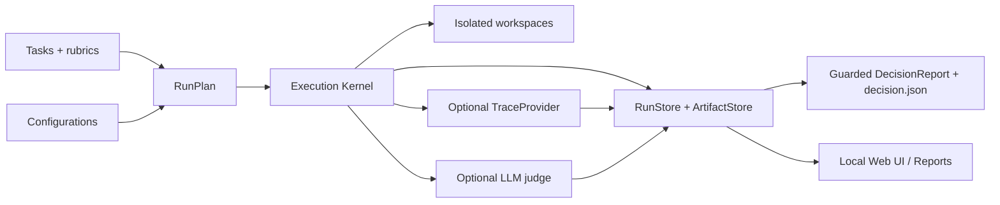

# micro-eval

[English](README.md) | [简体中文](README.zh-CN.md)

[](https://www.python.org/)
[](LICENSE)
[](VERSION)
[](docs/engineering/security-guidelines.md)

Current version: `0.5.0`

**A local-first Agent / Skill evaluation assistant for small AI teams that need evidence, not vibes.**

`micro-eval` turns “the candidate feels better” into a reproducible comparison: the same tasks, the same starting point, the same evidence chain, and a guarded decision about where a baseline or candidate is stronger, weaker, inconclusive, or not comparable.

Version **0.5.0** adds browser-based configuration and task setup to **Team Server** (`micro-eval serve`), five bundled starter tasks, live job progress, and cancellation with partial results. Baseline/candidate comparisons now show task-level deltas and link guarded verdicts to their evidence across reports and the Web UI.

Cell setup, single-turn agents, and command validators run through the selected workspace provider: local logical workspaces, optional Seatbelt/Bubblewrap OS policies, or optional E2B/Modal sandboxes. Conversational evaluation uses a JSONL bridge and currently requires logical isolation. Langfuse, DeepEval, E2B, and Modal remain optional extras; deterministic local evaluation works without external services. See the bilingual [documentation site](https://xiaozhenliu.github.io/micro-eval/) for setup, examples, and provider limits.

## Why micro-eval?

Small AI engineering teams often compare prompt, skill, agent, or tool changes with manual impressions. That breaks down when runs are flaky, starting states differ, artifacts disappear, or the UI makes a stronger claim than the evidence supports. `micro-eval` keeps the evaluation loop local and auditable:

- Define tasks and configurations in YAML.
- Expand `tasks × configurations × repetitions` into a canonical run matrix.
- Run local agent CLIs through argv-only subprocess invocations.
- Preserve stdout, stderr, generated artifacts, validation evidence, and human evaluation notes.
- Downgrade decisions when snapshots, evidence, or sample size do not justify a strong claim.

## Features

- **Canonical configuration matrix**: `tasks × configurations × repetitions` expands into `RunPlan` / `RunCell` records.
- **Self-owned execution layer**: asyncio bounded concurrency, per-cell timeout, and non-blocking cell failures.
- **Safe subprocess contract**: canonical `agent.command` is an argv list; legacy string commands only pass through a migration bridge with warnings.
- **Same-start evidence**: `SameStartSnapshot`, `CellSnapshot`, `SnapshotGateResult`, and `ReplayCanonical` are persisted with the run.
- **Workspace providers**: `blank`, `files`, and `git_repo` workspaces support per-cell setup, single-turn agent execution, and command validation through one provider context. Choose `logical` (default), `os_policy` (Seatbelt on macOS or Bubblewrap on Linux), `container` (Modal), or `vm` (E2B).
- **Explicit isolation limits**: unavailable OS policy may fall back to logical isolation with a recorded caveat; a selected provider's execution failure never triggers a local fallback. Remote providers require their SDKs and credentials.
- **Artifact / evidence / trace chain**: `manifest.json` indexes `ArtifactRef`, `EvidenceItem`, and optional `TraceRef` records.
- **Deterministic validation**: supports `exit_code`, `contains`, `file_exists`, and argv-only `command` expectations.
- **Pass@k / pass^k aggregation**: repeated cells produce per-configuration pass rates, latency summaries, low-sample caveats, and `CostMetric` source metadata.
- **Human evaluation persistence**: the UI appends human `EvaluationResult` records through the local API; `localStorage` is not treated as trusted evaluation state.
- **Default-off LLM judge**: an optional DeepEval adapter can append supplemental judge evaluations without overriding deterministic pass/fail results.
- **Guarded decisions**: snapshot mismatch, missing evidence, or insufficient repetitions produce caveats instead of fake winner claims.
- **Cross-run trend analysis**: SQLite-indexed run data enables time-series trend queries per configuration, with drift-aware breakpoints when configuration content changes across runs.
- **Local review UI/API**: a Next.js UI reads canonical run, cell, artifact, evaluation, trace, cost, trend, and decision data through zod schemas.
- **Team Server**: browser configuration/task forms, an Advanced YAML editor, starter templates, a serial run queue, job progress/cancellation, and member attribution for trusted internal networks.
- **Conversational evaluation**: multi-turn evaluation through DeepEval ConversationSimulator and a JSONL subprocess bridge, with logical isolation only.

## Quick Start

### Prerequisites

- Python 3.11+
- [`uv`](https://docs.astral.sh/uv/) for local Python environment and command execution
- Node.js/npm only when you want to run the source-checkout Web UI

Install from a source checkout:

```bash
git clone https://github.com/xiaozhenliu/micro-eval.git
cd micro-eval
uv sync --all-extras
cd ui && npm install && cd ..
uv run micro-eval --help
```

From an evaluation project directory, create and run a starter evaluation. If you have not installed the CLI into your active environment, replace `micro-eval` with `uv run --project /path/to/micro-eval micro-eval`.

```bash
micro-eval init --force
micro-eval validate
micro-eval run --max-concurrency 2
micro-eval list
micro-eval report --format text
micro-eval report --format html --output report.html
micro-eval ui --port 3000
```

In the Web UI, follow: Run List → Decision Summary → Result Matrix → Cell Evidence → Review Page → Artifact / Trace Viewer → Human Evaluation → Decision/Caveats.

For the shared Team Server workflow, run `uv run micro-eval serve` from the source checkout. Choose a starter template, create a workspace, configure agents and tasks in the browser, then preview and enqueue a run. `serve` opens the browser in an interactive terminal; use `--no-open` to suppress it. Team Server has no authentication and is intended only for trusted internal networks.

### Ready-to-run example

Use the repository example when you want a complete MVP flow without writing your own `eval.yaml`, task, or fixture workspace:

```bash
python examples/run-example.py
```

The script is a cross-platform Python entrypoint: it uses `uv run --project` when `uv` is available, falls back to an installed `micro-eval`, runs from the example directory so `.micro-eval/runs` is easy to find, and writes `examples/agent-codefix-showdown/report.html`.

For the real-agent matrix, run:

```bash
python examples/run-example.py --real
```

The real-agent matrix in [`examples/agent-codefix-showdown/`](examples/agent-codefix-showdown/) covers Claude Code, Codex CLI, OpenClaw, and Hermes. Additional examples cover multi-task matrices, git workspace isolation, and trend analysis:

```bash
python examples/run-example.py --example multi-task-matrix
python examples/run-example.py --example git-workspace-isolation
python examples/run-example.py --example all
```

[`examples/conversational-eval/`](examples/conversational-eval/) demonstrates multi-turn conversational evaluation (`judge.provider: deepeval_conversational`) with an echo agent; run it directly with `micro-eval run --config examples/conversational-eval/eval.yaml`.

The example index and capability coverage matrix are in [`examples/`](examples/).

## CLI Commands

Config lookup order is `--config` → `$MICRO_EVAL_CONFIG` → `./eval.yaml`.

| Command | Purpose |
| --- | --- |
| `micro-eval init [--force]` | Generate a canonical `eval.yaml`, `tasks/hello.yaml`, and starter task templates. |
| `micro-eval validate [--format text\|json]` | Load config/tasks, build the RunPlan, and print actionable diagnostics without running agents. |
| `micro-eval run [--config eval.yaml] [--max-concurrency N] [--dry-run] [--format text\|json]` | Execute the matrix run or print the RunPlan. |
| `micro-eval list [--format text\|json]` | List `.micro-eval/runs/*/run.json` records. |
| `micro-eval report [--run RUN_ID] [--format text\|json\|html]` | Render the matrix, Basic Honest Stats, decision/caveats, and artifacts. |
| `micro-eval apply-evaluation --run-id ID --cell-id ID` | Apply a human evaluation via stdin JSON and recompute the run decision (used by the UI). |
| `micro-eval build-plan --workspace PATH` | Construct a `RunPlan` from `eval.yaml` and print it as JSON to stdout. Runtime configuration overrides are not supported. |
| `micro-eval config <command> --project PATH` | Read/edit configurations and tasks, or use `show-raw` / `set-raw` for validated YAML editing. |
| `micro-eval ui [--port 3000]` | Start the local Next.js UI from a source checkout. |
| `micro-eval serve [--port 3000] [--host HOST] [--data-root PATH] [--no-open]` | Start the Team Server (Next.js + worker) for shared, trusted-LAN use. |
| `micro-eval worker [--data-root PATH]` | Start the run worker standalone (used internally by `serve`, or independently). |
| `micro-eval workspace create\|list\|update\|delete` | Manage server workspaces (create, list, update metadata, delete). |
| `micro-eval workspace enqueue ID [--dry-run] [--owner MEMBER]` | Preview a workspace plan or enqueue it; use the preview's digest with `--expected-plan-digest` to reject intervening changes. |
| `micro-eval template create\|update\|list\|delete` | Manage the read-only evaluation template library. |
| `micro-eval queue status\|cancel` | Show run-queue status or cancel a queued/running job. |

## Upgrading to 0.5.0

- Legacy `baseline` / `candidate` configs still load. Convert them to `configurations[]` in the Advanced YAML editor before using the basic browser forms.
- Older runs without the new roles/contract fields remain readable. Recomputed decisions use only saved run data; a missing contract yields `comparison_contract_unavailable` and `inconclusive`, without guessing from the current `eval.yaml`. Start a new run with explicit roles and an evaluation contract for the new comparison output.
- Set `evaluation.decision_threshold` to a value in `(0, 1]` or `null`. Zero, negative, and greater-than-one values are invalid; `null` does not produce an automatic winner.
- Strict JSON clients must accept `cancelled` run status, nullable `decision.comparison`, and the new `configuration_roles` / `evaluation_contract` fields.

## Configuration and Tasks

New projects should use canonical `configurations[]`; legacy `baseline` / `candidate` config files still load through an explicit migration bridge.

A minimal config declares configurations, tasks, guardrails, and evaluation policy:

```yaml
project_name: demo-agent-eval
configurations:
  - id: baseline
    role: baseline
    repetitions: 1
    agent:
      command: ["cat"]
      input_mode: stdin
      output_mode: stdout
      timeout_s: 10
  - id: candidate
    role: candidate
    repetitions: 1
    agent:
      command: ["cat"]
      input_mode: stdin
      output_mode: stdout
      timeout_s: 10
tasks:
  - tasks/hello.yaml
guardrails:
  max_concurrency: 2
  timeout_s: 30
evaluation:
  comparison_subject: "candidate vs baseline"
  min_repetitions: 1
  required_evaluators: [validator]
trace:
  enabled: false
  provider: process   # or langfuse when the optional extra and credentials are configured
judge:
  enabled: false
  provider: deepeval
  model: ""
  pass_threshold: 0.5
  required_secrets: []
```

A task describes input, expectations, workspace, and optional rubric metadata:

```yaml
id: hello
name: Hello echo
input_payload: "Hello, micro-eval!"
expectations:
  - type: contains
    stream: output
    value: "Hello, micro-eval!"
workspace:
  type: blank
rubric: Output should contain the input exactly.
```

See [`eval.yaml.example`](eval.yaml.example), [`examples/`](examples/), and [`docs/DEVELOPMENT.md`](docs/DEVELOPMENT.md) for the current source-checkout workflow.

## Run Artifacts

Runs are stored under the project output directory, defaulting to `.micro-eval/runs/`:

```text
.micro-eval/runs/{run_id}/
├── run.json
├── decision.json
├── manifest.json
└── cells/{cell_id}/
    ├── result.json
    ├── stdout.txt
    ├── stderr.txt
    ├── output.txt
    └── evaluation.json
```

The decision trace is explicit: `decision.evaluation_refs → EvaluationResult.evidence_refs → EvidenceItem.artifact_refs/source_ref → ArtifactRef.path`, with optional `TraceRef` links for process or Langfuse trace metadata.

## Security and Local Data

`micro-eval` runs agent commands locally or in the selected remote provider. Review tasks, workspaces, credentials, and the provider's limits before running real agents.

- Canonical agent and validation commands are argv lists; trusted paths do not use shell interpolation.
- Agent cwd is the assigned cell workspace.
- Default `logical` workspaces do not restrict host-file or network access. If no OS-policy provider is available, a request for `os_policy` falls back to `logical` and records a caveat.
- OS and remote providers support `full` or `none` network policy and reject `allowlist`. OS policy defaults to `full`; remote providers default to `none`. OS policies do not make host-readable files confidential, and process-group cleanup cannot cover descendants that deliberately leave the group.
- Remote providers never fall back to local execution. SDK contract tests do not establish live cloud isolation or termination guarantees; remote workspace observation is unavailable.
- Secrets must use `MICRO_EVAL_SECRET_*` environment variables and be explicitly declared by a configuration.
- Declared and detected `MICRO_EVAL_SECRET_*` values are redacted before stdout/stderr/text artifacts/evidence/human comments are persisted.
- Complete binary artifacts cannot be text-redacted and retain an explicit warning. Starter-task protected-test checks detect file changes but do not provide process isolation from the submitted Python module.
- Raw artifact access is mediated by manifest `artifact_id` plus run-directory boundary checks.
- Trace and judge integrations are default-off optional extras. Credentials stay in environment variables, not `eval.yaml`, run JSON, artifacts, or release docs.
- Team Server provides member attribution and Host checks for trusted networks, without authentication or a multi-tenant security boundary.

Public release commits use a single-parent `main` history: `dev` supplies the allowed files without being merged into the public ancestry. The publisher verifies the candidate tree, history, and version 2 receipt before an explicitly authorized publication. See the [release process](docs/engineering/release-process.md) for the maintainer workflow.

For the authoritative security routing, see [`docs/engineering/security-guidelines.md`](docs/engineering/security-guidelines.md).

## Web UI

Launch the UI from the repository source checkout:

```bash
MICRO_EVAL_PROJECT_ROOT=/path/to/eval-project uv run micro-eval ui --port 3000
```

Routes:

| Route | Purpose |
| --- | --- |
| `/` | Run List |
| `/run/[id]` | Decision Summary, caveats, Result Matrix, Cell Evidence, and Human Evaluation |
| `/run/[id]/review` | Human review surface with cost, trace, matrix heatmap, and per-cell evidence |
| `/run/[id]/artifact/[artifactId]` | Artifact viewer by manifest `artifact_id` |
| `/workspace/[id]/jobs/[jobId]` | Team Server job progress, cancellation, and completed-run navigation |
| `/api/runs/[id]/cells/[cellId]/trace` | Manifest-bound trace lookup for one cell |
| `/api/runs/...` | Read-only run/cell/artifact API plus append-only human evaluation API |

Binary, oversized, skipped, or boundary-invalid artifacts return warnings/placeholders rather than raw content.

## Architecture


```mermaid
flowchart LR
  TASKS["Tasks + rubrics"] --> PLAN["RunPlan"]
  CONFIGS["Configurations"] --> PLAN
  PLAN --> KERNEL["Execution Kernel"]
  KERNEL --> WORKSPACES["Isolated workspaces"]
  KERNEL --> TRACE["Optional TraceProvider"]
  KERNEL --> JUDGE["Optional LLM judge"]
  KERNEL --> STORE["RunStore + ArtifactStore"]
  TRACE --> STORE
  JUDGE --> STORE
  STORE --> DECISION["Guarded DecisionReport + decision.json"]
  STORE --> UI["Local Web UI / Reports"]
```

## Documentation

**Project website**: [https://xiaozhenliu.github.io/micro-eval/](https://xiaozhenliu.github.io/micro-eval/) — user-facing guides, reference, and examples in English and Chinese.

| Document | Purpose |
| --- | --- |
| [Project Website](https://xiaozhenliu.github.io/micro-eval/) | User-facing documentation site (VitePress, bilingual EN/ZH). |
| [`docs/README.md`](docs/README.md) | Documentation directory map and source-of-truth hierarchy. |
| [`docs/DEVELOPMENT.md`](docs/DEVELOPMENT.md) | Local setup, commands, module map, smoke flow, and release readiness checklist. |
| [`docs/engineering/security-guidelines.md`](docs/engineering/security-guidelines.md) | Security routing for development, user runs, service/API/report boundaries. |
| [`examples/README.md`](examples/README.md) | Source-checkout examples and onboarding use cases. |

## Development

```bash
uv sync --all-extras
uv run python -m compileall src/micro_eval tests
uv run pytest -q
(cd ui && npm run lint && npm run build)
uv build
git diff --check
```

Security regression greps used by the release gate:

```bash
grep -R "create_subprocess_shell" src tests ui || true
grep -R "shell=True" src tests ui || true
grep -R "localStorage" ui/src || true
grep -R "sessionStorage" ui/src || true
```

Pure documentation edits can usually be validated with `git diff --check`, but command, schema, or release-claim changes should run the relevant smoke command as well.

## License

Apache-2.0. See [`LICENSE`](LICENSE) and [`NOTICE`](NOTICE).

## Document metadata

```yaml
title: micro-eval README
doc_type: tutorial
status: active
created_at: 2026-05-31T01:43+08:00
updated_at: 2026-09-28T16:02+08:00
owner: micro-eval maintainers
source_of_truth: false
tags:
  - readme
  - onboarding
  - mvp
  - phase2
related:
  - README.zh-CN.md
  - docs/README.md
  - docs/DEVELOPMENT.md
  - docs/engineering/security-guidelines.md
```
