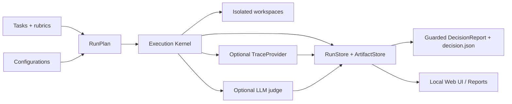

# micro-eval

[English](README.md) | [简体中文](README.zh-CN.md)

[](https://www.python.org/)
[](LICENSE)
[](VERSION)
[](docs/engineering/security-guidelines.md)

当前版本：`0.2.8`

**一个本地优先的 Agent / Skill 评测助手，帮助小型 AI 团队用证据而不是体感做对比。**

`micro-eval` 把“candidate 感觉更强”转化为可复现对比：同一批任务、同一起点、同一证据链，并基于受保护的决策逻辑判断 baseline / candidate 在哪些 cell 上更强、更弱、样本不足、不可比或需要人工判断。

0.2.0 将本地 MVP 扩展到 Phase 2：可复现矩阵执行现在会产出 pass@k / pass^k 聚合、独立 `decision.json`、可选 trace 捕获、cost source 展示、review UI，以及默认关闭的 LLM judge 适配器。Langfuse 和 DeepEval 仍是 optional extra；没有外部服务时，本地 subprocess 执行、artifact 和 deterministic validation 仍可工作。

## 为什么使用 micro-eval？

小型 AI 工程团队常用主观印象比较 prompt、skill、agent 或工具改动。但当 run 不稳定、起点不同、artifact 丢失，或 UI 给出超出证据的强结论时，这种方式会失效。`micro-eval` 把评测循环保留在本地，并让证据可审计：

- 用 YAML 定义 tasks 和 configurations。
- 将 `tasks × configurations × repetitions` 展开为 canonical run matrix。
- 通过 argv-only subprocess 调用本地 agent CLI。
- 持久化 stdout、stderr、生成 artifact、验证证据和人工评分记录。
- 当 snapshot、evidence 或样本量不足以支持强结论时，自动降级 decision 并输出 caveat。

## 功能特性

- **Canonical configuration matrix**：`tasks × configurations × repetitions` 展开为 `RunPlan` / `RunCell`。
- **自写执行层**：asyncio 有界并发、单 cell timeout，单个 cell 失败不阻塞其它 cell。
- **安全 subprocess 契约**：canonical `agent.command` 必须是 argv list；legacy string command 只通过 migration bridge 转换并产生 warning。
- **同起点证据**：`SameStartSnapshot`、`CellSnapshot`、`SnapshotGateResult` 和 `ReplayCanonical` 随 run 持久化。
- **Workspace 隔离**：支持 `blank`、`files`、`git_repo`，每个 cell 在分配的 workspace 中执行。
- **Artifact / Evidence / Trace 链**：`manifest.json` 索引 `ArtifactRef`、`EvidenceItem` 与可选 `TraceRef`。
- **Deterministic validation**：支持 `exit_code`、`contains`、`file_exists`、argv-only `command` expectation。
- **Pass@k / pass^k 聚合**：重复运行会产出按 configuration 聚合的 pass rate、latency、low-sample caveat 和 `CostMetric` source metadata。
- **人工评分持久化**：UI 通过本地 API append human `EvaluationResult`；不把 `localStorage` 当作可信评分状态。
- **默认关闭的 LLM judge**：可选 DeepEval adapter 能追加补充 judge evaluation，但不会覆盖 deterministic pass/fail。
- **Guarded decision**：snapshot mismatch、缺失 evidence 或 repetitions 不足会生成 caveat，而不是伪造 winner 结论。
- **本地 review UI/API**：Next.js UI 通过 zod 读取 canonical run、cell、artifact、evaluation、trace、cost 和 decision 数据。

## 快速开始

### 环境要求

- Python 3.11+
- [`uv`](https://docs.astral.sh/uv/) 用于本地 Python 环境和命令执行
- 只有运行 source-checkout Web UI 时才需要 Node.js/npm

从源码安装：

```bash
git clone https://github.com/xiaozhenliu/micro-eval.git
cd micro-eval
uv sync --all-extras
cd ui && npm install && cd ..
uv run micro-eval --help
```

在准备评测的本地项目目录中创建并运行 starter evaluation。如果还没有把 CLI 安装进当前 shell 环境，可以把 `micro-eval` 替换为 `uv run --project /path/to/micro-eval micro-eval`。

```bash
micro-eval init --force
micro-eval validate
micro-eval run --max-concurrency 2
micro-eval list
micro-eval report --format text
micro-eval report --format html --output report.html
micro-eval ui --port 3000
```

在 Web UI 中按以下路径查看：Run List → Decision Summary → Result Matrix → Cell Evidence → Review Page → Artifact / Trace Viewer → Human Evaluation → Decision/Caveats。

### Ready-to-run example

如果想体验完整 MVP 流程、但还不想自己写 `eval.yaml`、task 或 fixture workspace，可以直接运行源码仓库中的示例：

```bash
python examples/run-example.py
```

这个脚本是跨平台 Python 入口：有 `uv` 时自动使用 `uv run --project`，否则回退到已安装的 `micro-eval`；它会从示例目录运行，因此 `.micro-eval/runs` 容易定位，并生成 `examples/agent-codefix-showdown/report.html`。

如果要运行真实 agent 矩阵：

```bash
python examples/run-example.py --real
```

[`examples/agent-codefix-showdown/`](examples/agent-codefix-showdown/) 中的真实 agent 矩阵覆盖 Claude Code、Codex CLI、OpenClaw 和 Hermes。示例索引见 [`examples/`](examples/)。

## CLI 命令

Config 查找顺序为：`--config` → `$MICRO_EVAL_CONFIG` → `./eval.yaml`。

| 命令 | 用途 |
| --- | --- |
| `micro-eval init [--force]` | 生成 canonical `eval.yaml`、`tasks/hello.yaml` 和 starter task templates。 |
| `micro-eval validate [--format text\|json]` | 加载 config/tasks、构建 RunPlan，并在不运行 agent 的情况下输出可操作诊断。 |
| `micro-eval run [--config eval.yaml] [--max-concurrency N] [--dry-run] [--format text\|json]` | 执行矩阵 run，或只打印 RunPlan。 |
| `micro-eval list [--format text\|json]` | 列出 `.micro-eval/runs/*/run.json` 记录。 |
| `micro-eval report [--run RUN_ID] [--format text\|json\|html]` | 输出矩阵、Basic Honest Stats、decision/caveats 和 artifacts。 |
| `micro-eval ui [--port 3000]` | 从源码 checkout 启动本地 Next.js UI。 |

## Configuration 和 Tasks

新项目应使用 canonical `configurations[]`；legacy `baseline` / `candidate` config 文件仍可通过显式 migration bridge 加载。

最小 config 声明 configurations、tasks、guardrails 和 evaluation policy：

```yaml
project_name: demo-agent-eval
configurations:
  - id: baseline
    role: baseline
    repetitions: 1
    agent:
      command: ["cat"]
      input_mode: stdin
      output_mode: stdout
      timeout_s: 10
  - id: candidate
    role: candidate
    repetitions: 1
    agent:
      command: ["cat"]
      input_mode: stdin
      output_mode: stdout
      timeout_s: 10
tasks:
  - tasks/hello.yaml
guardrails:
  max_concurrency: 2
  timeout_s: 30
evaluation:
  comparison_subject: "candidate vs baseline"
  min_repetitions: 1
  required_evaluators: [validator]
trace:
  enabled: false
  provider: process   # or langfuse when the optional extra and credentials are configured
judge:
  enabled: false
  provider: deepeval
  model: ""
  pass_threshold: 0.5
  required_secrets: []
```

Task 描述输入、expectations、workspace 和可选 rubric 元数据：

```yaml
id: hello
name: Hello echo
input_payload: "Hello, micro-eval!"
expectations:
  - type: contains
    stream: output
    value: "Hello, micro-eval!"
workspace:
  type: blank
rubric: Output should contain the input exactly.
```

更多当前 source-checkout 工作流见 [`eval.yaml.example`](eval.yaml.example)、[`examples/`](examples/) 和 [`docs/DEVELOPMENT.md`](docs/DEVELOPMENT.md)。

## Run Artifacts

Run 默认存储在项目输出目录 `.micro-eval/runs/`：

```text
.micro-eval/runs/{run_id}/
├── run.json
├── decision.json
├── manifest.json
└── cells/{cell_id}/
    ├── result.json
    ├── stdout.txt
    ├── stderr.txt
    ├── output.txt
    └── evaluation.json
```

Decision trace 是显式链路：`decision.evaluation_refs → EvaluationResult.evidence_refs → EvidenceItem.artifact_refs/source_ref → ArtifactRef.path`；启用 trace 时还会通过 `TraceRef` 关联 process 或 Langfuse trace metadata。

## 安全和本地数据

`micro-eval` 会在你的机器上运行本地 agent 命令。运行真实 agent 前，请先检查 task、workspace 和凭证。

- Canonical agent 和 validation command 都是 argv list；可信执行路径不使用 shell interpolation。
- Agent cwd 是分配给 cell 的 workspace。
- 本地 runner 不提供网络隔离；本地 CLI 可能按自身配置访问外部服务。
- Secrets 必须使用 `MICRO_EVAL_SECRET_*` 环境变量，并由 configuration 显式声明。
- 已声明和检测到的 `MICRO_EVAL_SECRET_*` 值会在 stdout/stderr/text artifact/evidence/human comment 持久化前被 redaction。
- Raw artifact 访问必须经过 manifest `artifact_id` 和 run-directory 边界校验。
- Trace 和 judge 集成默认关闭且为 optional extra。凭证保留在环境变量中，不写入 `eval.yaml`、run JSON、artifact 或 release docs。

权威安全路由见 [`docs/engineering/security-guidelines.md`](docs/engineering/security-guidelines.md)。

## Web UI

从仓库源码 checkout 启动 UI：

```bash
MICRO_EVAL_PROJECT_ROOT=/path/to/eval-project uv run micro-eval ui --port 3000
```

路由：

| Route | 用途 |
| --- | --- |
| `/` | Run List |
| `/run/[id]` | Decision Summary、caveats、Result Matrix、Cell Evidence 和 Human Evaluation |
| `/run/[id]/review` | Phase 2 review surface，包含 cost、trace、matrix heatmap 和 per-cell evidence |
| `/run/[id]/artifact/[artifactId]` | 通过 manifest `artifact_id` 查看 artifact |
| `/api/runs/[id]/cells/[cellId]/trace` | 按 manifest 边界读取单个 cell 的 trace |
| `/api/runs/...` | read-only run/cell/artifact API + append-only human evaluation API |

Binary、oversized、skipped 或越界 artifact 会返回 warning/placeholder，而不是原始内容。

## 架构



## 文档导航

| 文档 | 用途 |
| --- | --- |
| [`docs/README.md`](docs/README.md) | 文档目录地图和 source-of-truth 层级。 |
| [`docs/DEVELOPMENT.md`](docs/DEVELOPMENT.md) | 本地环境、常用命令、模块地图、smoke flow 和 release readiness checklist。 |
| [`docs/engineering/security-guidelines.md`](docs/engineering/security-guidelines.md) | 开发实现、用户 run、服务/API/report 边界的安全路由。 |
| [`examples/README.md`](examples/README.md) | Source-checkout examples 和 onboarding use cases。 |

## 开发

```bash
uv sync --all-extras
uv run python -m compileall src/micro_eval tests
uv run pytest -q
(cd ui && npm run lint && npm run build)
uv build
git diff --check
```

Release gate 使用的安全回归 grep：

```bash
grep -R "create_subprocess_shell" src tests ui || true
grep -R "shell=True" src tests ui || true
grep -R "localStorage" ui/src || true
grep -R "sessionStorage" ui/src || true
```

纯文档改动通常可以用 `git diff --check` 验证；如果文档改了命令、schema 或 release claims，应额外运行对应 smoke command。

## License

Apache-2.0。见 [`LICENSE`](LICENSE) 和 [`NOTICE`](NOTICE)。

## 文档元信息

```yaml
title: micro-eval 中文 README
doc_type: tutorial
status: active
created_at: 2026-06-03T15:56+08:00
updated_at: 2026-06-12T12:35+08:00
owner: micro-eval maintainers
source_of_truth: false
tags:
  - readme
  - onboarding
  - mvp
  - phase2
  - zh-CN
related:
  - README.md
  - docs/README.md
  - docs/DEVELOPMENT.md
  - docs/engineering/security-guidelines.md
```
