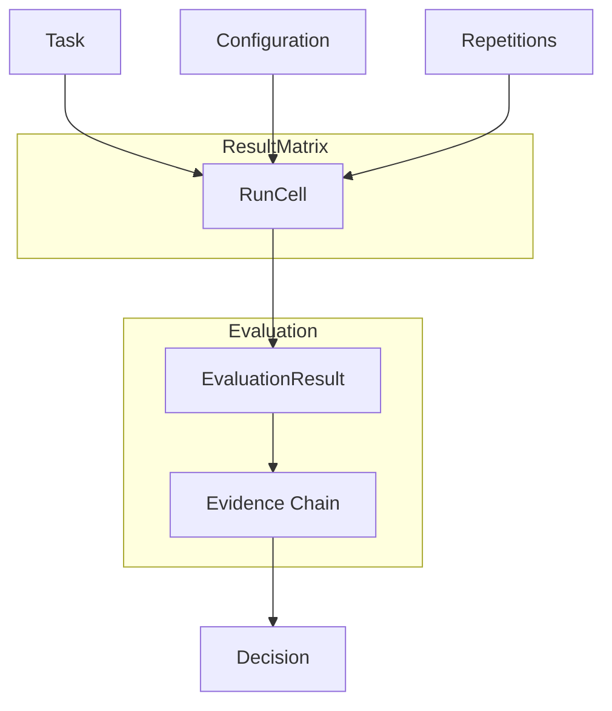

# Core Concepts

micro-eval turns "I think this agent is better" into a quantified, traceable, reproducible conclusion. This page defines every building block and shows how they compose into a complete evaluation.

## The Mental Model

Everything in micro-eval flows from one equation:

> **Run = Tasks × Configurations × Repetitions → ResultMatrix**

Each cell in that matrix is one execution. Cells accumulate evidence. Evidence drives a guarded Decision.



---

## Concepts

### Configuration

The **column** in the result matrix. A Configuration defines what is being tested: an AgentSpec, an optional SkillSpec, an Environment, execution Params, and how many Repetitions to run. Two Configurations that differ only in model name produce two columns you can compare side-by-side.

```yaml
configurations:
  - name: claude-sonnet
    agent: agents/coder.yaml
    params:
      model: claude-sonnet-4-5
    repetitions: 3
  - name: claude-haiku
    agent: agents/coder.yaml
    params:
      model: claude-haiku-4-5
    repetitions: 3
```

### AgentSpec

The complete invocation contract for one agent. It specifies the command argv, how input is delivered (`stdin` or `file`), how output is collected (`stdout` or `file`), a timeout in seconds, extra environment variables, and which secrets from `MICRO_EVAL_SECRET_*` are required.

```yaml
command: ["uv", "run", "my-agent", "--input", "{input_file}"]
input_mode: file
output_mode: stdout
timeout_s: 120
required_secrets: [API_KEY]
```

### Task

The **row** in the result matrix. A Task describes what to test: a prompt, a WorkspaceSpec that sets up the filesystem, a list of Expectations for deterministic validation, and an optional rubric for LLM-judge or human scoring.

```yaml
tasks:
  - name: add-docstrings
    prompt: "Add Google-style docstrings to all public functions in src/"
    workspace:
      type: git_repo
      repo: https://github.com/example/project
      ref: abc1234
    expectations:
      - type: exit_code
        value: 0
      - type: file_exists
        path: src/utils.py
```

### WorkspaceSpec

Defines the execution environment every RunCell starts from. Three workspace types are supported:

| Type | Use case |
|------|----------|
| `blank` | Stateless tasks, no filesystem needed |
| `files` | Static file fixtures copied in before each run |
| `git_repo` | Real repo checked out at a pinned commit |

Isolation level controls the sandbox boundary:

| Level | Mechanism |
|-------|-----------|
| `logical` | git worktree — default, zero overhead |
| `os_policy` | Seatbelt (macOS) / Bubblewrap (Linux) syscall filter |
| `container` | OCI container |
| `vm` | Remote VM via E2B or Modal |

::: tip Same-start guarantee
For results to be comparable, every cell in a Run must start from the same WorkspaceSpec. micro-eval hashes the workspace state (fixture digest + toolchain fingerprint) into `SameStartSnapshot` and flags cells where this differs with a `snapshot_mismatch` Caveat.
:::

### Run

One complete execution across the full `Tasks × Configurations × Repetitions` cartesian product. A Run produces a RunPlan before execution begins, then fans out into RunCells that execute with bounded asyncio concurrency.

### RunPlan

The canonical, serialized execution plan generated before any subprocess starts. It lists every (task, configuration, repetition) triple, workspace hashes, and the expected cell count. The plan is saved to `.micro-eval/` so you can audit exactly what was scheduled.

### RunCell

One atomic execution: a single (task, configuration, repetition) triple. The runner forks a subprocess using argv-only invocation (no shell interpolation), captures stdout/stderr, and writes artifacts to a per-cell directory.

### Expectation

Deterministic, zero-LLM validation rules evaluated against RunCell output. Four types are available:

::: code-group

```yaml [exit_code]
- type: exit_code
  value: 0
```

```yaml [contains]
- type: contains
  in: stdout
  value: "def process("
```

```yaml [file_exists]
- type: file_exists
  path: output/report.md
```

```yaml [command]
- type: command
  run: ["python", "-m", "pytest", "tests/", "-q"]
  expect_exit: 0
```

:::

### EvaluationResult

The scored outcome for one RunCell. It is produced by the evaluation pipeline — deterministic validator first, then optional LLM judge, then human annotation. Each stage can add score contributions and evidence items.

### Evidence Chain

The full traceback from a Decision down to raw artifacts:

```
Decision
  └── EvaluationResult (per cell)
        └── EvidenceItem (per expectation / judge call)
              └── ArtifactRef → .micro-eval/<run>/<cell>/stdout.txt
```

### Decision

The guarded conclusion for one comparison (typically one Task across two or more Configurations). A Decision carries a `DecisionStatus`, a summary, and any Caveats that weaken the conclusion.

### DecisionStatus

| Status | Meaning |
|--------|---------|
| `improved` | Statistically significant gain |
| `regressed` | Statistically significant loss |
| `mixed` | Some tasks improved, others regressed |
| `inconclusive` | Difference exists but below significance threshold |
| `not_comparable` | Cells have mismatched snapshots or configs |
| `needs_human_review` | Automated evidence is insufficient |

### Caveat

A structured warning attached to a Decision that weakens or invalidates its conclusion. Common caveats:

- `snapshot_mismatch` — workspace state differed across cells
- `low_sample` — fewer repetitions than recommended for significance
- `missing_evidence` — one or more cells have no EvaluationResult
- `config_drift` — Configuration parameters changed mid-run

::: warning Caveats are not optional
micro-eval surfaces caveats prominently in the UI and report output. A Decision with active caveats cannot be promoted to `improved` or `regressed` — it becomes `not_comparable` or `needs_human_review` instead.
:::

---

## How It All Fits Together

A typical micro-eval workflow maps directly onto these concepts:

1. **Define Tasks** (rows) and **Configurations** (columns) in `eval.yaml`
2. `micro-eval run` builds a **RunPlan**, then executes **RunCells** in parallel
3. Each cell's output is validated by **Expectations** → **EvaluationResults**
4. Results are aggregated with an optional LLM judge and human annotation
5. The **Decision** layer reads the **Evidence Chain** and emits a **DecisionStatus** with any **Caveats**
6. `micro-eval report` and the Next.js UI render the full **ResultMatrix**

Next: [Tasks & Expectations](./tasks) | [Configuration](./configuration) | [Workspace Isolation](./workspace-isolation)
