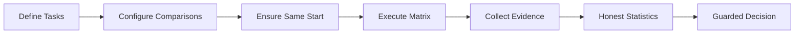
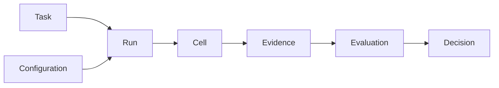

# Design System

micro-eval's features all serve one decision loop. Understanding this loop and its design principles matters more than memorizing config fields.

## The Decision Loop

Everything in micro-eval flows from one equation:

> **Run = Tasks × Configurations × Repetitions → ResultMatrix → Decision**

Each step in the pipeline has a job. None is optional.

::: warning Why every step matters
If this loop breaks at any point, the product degrades to "show results and let users guess." That is not a decision tool.
:::

## Three Design Tensions

Every feature in micro-eval resolves one of three tensions. Knowing them helps you understand why things work the way they do.

| Tension | What it means for you | Where you see it in the product |
|---|---|---|
| **Evidence-first** | Every conclusion can be drilled down to raw artifacts. A score is worthless without the artifact that produced it. | Evidence Chain, artifact links on result pages, Decision must cite Evaluations |
| **Same-start** | Within the same Task row, all Configuration and Repetition cells must start from an equivalent workspace snapshot. Different Task rows may use different workspaces. | SameStartSnapshot, workspace isolation, `not_comparable` status |
| **Honest boundaries** | "Insufficient samples to judge" is a correct answer, not a bug. The tool should never manufacture confidence it does not have. | Six DecisionStatus values (including `inconclusive`), Caveat mechanism, confidence grading |

::: tip Tension, not contradiction
These three goals occasionally push against each other — more evidence costs more execution time; stricter same-start can block fast iteration. micro-eval surfaces the trade-off rather than hiding it.
:::

## Core Objects {#core-objects}

Seven objects carry data through the loop. Each has one clear role.

| Object | Matrix role | One sentence |
|---|---|---|
| **Task** | Row | What to test — prompt, workspace, and acceptance criteria. |
| **Configuration** | Column | What is being tested — agent, parameters, and environment. |
| **Run** | The matrix itself | One complete Tasks × Configs × Reps execution producing a ResultMatrix. |
| **Cell** | Cell | One atomic execution — a single (task, config, repetition) combination. |
| **Evidence** | Fact record | Stdout, diff, cost data; immutable, redacted, and sourced back to the cell. |
| **Evaluation** | Scoring judgment | Deterministic validator → LLM judge → human annotation, applied in layers. |
| **Decision** | Actionable conclusion | `improved` / `regressed` / `inconclusive` plus any caveats. |

::: tip Secondary objects
These are the core objects. Others — AgentSpec, WorkspaceSpec, RunPlan, Expectation, Caveat — are secondary. You encounter them as needed when configuring specific features.
:::

::: info Server Mode Extensions (v0.4)
The Team Server adds three operational concepts that sit outside the core seven:

- **Workspace** — an isolated evaluation environment on the server, owned by a team member. Logically equivalent to a local `project_root`.
- **Template** — a read-only configuration blueprint in the shared template library. Members create workspaces from templates.
- **Job** — a queued run request. The server executes jobs serially via a worker process.

These are infrastructure-layer concepts. The core decision loop (Task → Configuration → Run → Cell → Evidence → Evaluation → Decision) remains unchanged in server mode.
:::

## What These Principles Mean for You

Four practical consequences you will encounter as a user:

- **"Inconclusive" is not a bug.** If your run reports `inconclusive`, the sample size was too small to tell. Add repetitions and re-run.
- **Workspace drift blocks comparison.** If workspace state differs across configurations, results are marked `not_comparable`. Commit or stash your changes before running.
- **Every score has an evidence link.** You can always drill down from a Decision to the raw artifact that produced it. If you cannot, file a bug.
- **Deterministic checks run first.** Exit code, file existence, and test-pass validators run before any LLM judgment. If deterministic checks fail, LLM scoring is skipped.
