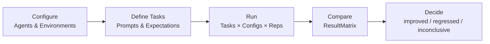

# What is micro-eval?

## The Problem

Small AI teams move fast. When two agents, prompts, or skill configurations produce different outputs, the decision about which one is better often comes down to gut feeling — "this one _feels_ more accurate." That works for a prototype. It breaks down the moment you need to justify a change, reproduce a result, or hand off a decision to someone else.

**micro-eval turns "I think this agent is better" into a traceable, reproducible conclusion.**

## The Solution

micro-eval is a local-first evaluation tool that runs your agents and skills against a defined task matrix, collects structured results, and surfaces a decision backed by scores, traces, and diffs. You define what "correct" looks like (exit codes, output patterns, file existence, or custom commands), run the matrix, and get a comparison you can share and revisit. No hosted service, no vendor lock-in — just a YAML config, a CLI, and a local web UI reading files from `.micro-eval/`.

## Core Workflow

## Key Design Principles

- **Local-first.** All data lives in `.micro-eval/` on your machine. No accounts, no cloud sync required.
- **Evidence-backed decisions.** Every conclusion links back to the task, trace, diff, and cost that produced it.
- **Reproducible starting points.** Runs capture workspace state, repo commit, skill version, and sandbox config — so results can be trusted and compared across time.
- **Guarded evaluation.** Deterministic validators run first; LLM judges and human annotation fill in where determinism cannot.

## Who is micro-eval for?

micro-eval targets **1–20 person AI teams** who are:

- Comparing agent configurations, skill versions, or model choices
- Validating that a prompt change is an improvement, not a regression
- Building internal benchmarks for their own tasks and workflows
- Iterating quickly and needing lightweight, reproducible evidence

::: tip You do not need infrastructure
micro-eval runs entirely on your laptop. The only external dependencies are the agents you are evaluating.
:::

## What micro-eval is NOT

::: warning Out of scope
- **Not a public benchmark leaderboard.** It evaluates _your_ agents on _your_ tasks, not standardized public suites.
- **Not a hosted SaaS.** There is no cloud backend, no accounts, no data leaving your machine.
- **Not a production monitoring tool.** It is designed for offline, deliberate evaluation cycles — not real-time alerting.
:::

## Next Steps

Ready to run your first evaluation?

- [Getting Started](/guide/getting-started) — install and run your first comparison in 10 minutes
- [Design System](/guide/design-system) — understand the core principles before diving into configuration
