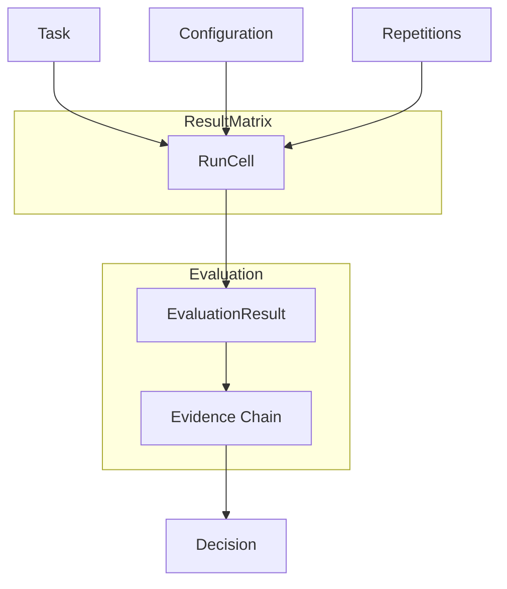

# 核心概念

micro-eval 将"我觉得这个 agent 更强"转化为可量化、可溯源、可复现的结论。本页面定义了所有构建块，并展示它们如何组合成一次完整的评测。

## 心智模型

micro-eval 中的一切都源自一个等式：

> **Run = Tasks × Configurations × Repetitions → ResultMatrix**

矩阵中的每个单元格对应一次执行。单元格积累证据，证据驱动有守卫的 Decision。



---

## 概念

### Configuration

结果矩阵中的**列**。Configuration 定义了被测对象：一个 AgentSpec、一个可选的 SkillSpec、一个 Environment、执行 Params，以及需要运行的 Repetitions 次数。两个仅 model 名称不同的 Configuration 会产生两列可并排对比的数据。

```yaml
configurations:
  - name: claude-sonnet
    agent: agents/coder.yaml
    params:
      model: claude-sonnet-4-5
    repetitions: 3
  - name: claude-haiku
    agent: agents/coder.yaml
    params:
      model: claude-haiku-4-5
    repetitions: 3
```

### AgentSpec

一个 agent 的完整调用契约。它指定了命令 argv、输入传递方式（`stdin` 或 `file`）、输出收集方式（`stdout` 或 `file`）、超时秒数、额外的环境变量，以及需要从 `MICRO_EVAL_SECRET_*` 中读取的 secrets。

```yaml
command: ["uv", "run", "my-agent", "--input", "{input_file}"]
input_mode: file
output_mode: stdout
timeout_s: 120
required_secrets: [API_KEY]
```

### Task

结果矩阵中的**行**。Task 描述了测试内容：一个 prompt、一个用于设置文件系统的 WorkspaceSpec、一组用于确定性验证的 Expectations，以及一个可选的评分 rubric（用于 LLM judge 或人工评分）。

```yaml
tasks:
  - id: add-docstrings
    name: Add docstrings
    input_payload: "Add Google-style docstrings to all public functions in src/"
    workspace:
      type: git_repo
      path: ./fixtures/project
      ref: abc1234
    expectations:
      - type: exit_code
        value: 0
      - type: file_exists
        path: src/utils.py
```

### WorkspaceSpec

定义每个 RunCell 启动时的执行环境。支持三种 workspace 类型：

| 类型 | 使用场景 |
|------|----------|
| `blank` | 无状态任务，不需要文件系统 |
| `files` | 每次运行前复制静态文件 fixture |
| `git_repo` | 检出到固定 commit 的真实仓库 |

隔离级别控制沙箱边界：

| 级别 | 机制 |
|-------|-----------|
| `logical` | git worktree — 默认，零开销 |
| `os_policy` | Seatbelt（macOS）/ Bubblewrap（Linux）系统调用过滤 |
| `container` | OCI 容器 |
| `vm` | 通过 E2B 或 Modal 的远程 VM |

::: tip 同起点保证
为使结果具有可比性，一次 Run 中的每个单元格必须从相同的 WorkspaceSpec 启动。micro-eval 将 workspace 状态（fixture digest + toolchain fingerprint）哈希到 `SameStartSnapshot` 中，并用 `snapshot_mismatch` Caveat 标记存在差异的单元格。
:::

### Run

跨完整 `Tasks × Configurations × Repetitions` 笛卡尔积的一次完整执行。Run 在执行开始前生成一个 RunPlan，然后扩展为以有界 asyncio 并发执行的 RunCell。

### RunPlan

在任何子进程启动之前生成的规范化、序列化执行计划。它列出了每个（task、configuration、repetition）三元组、workspace 哈希值以及预期的单元格数量。计划保存到 `.micro-eval/`，以便审计确切的调度内容。

### RunCell

一次原子执行：单个（task、configuration、repetition）三元组。runner 使用仅 argv 调用（无 shell 插值）fork 一个子进程，捕获 stdout/stderr，并将产物写入单元格专属目录。

### Expectation

针对 RunCell 输出评估的确定性、零 LLM 验证规则。提供四种类型：

::: code-group

```yaml [exit_code]
- type: exit_code
  value: 0
```

```yaml [contains]
- type: contains
  stream: stdout
  value: "def process("
```

```yaml [file_exists]
- type: file_exists
  path: output/report.md
```

```yaml [command]
- type: command
  command: ["python", "-m", "pytest", "tests/", "-q"]
  cwd: "{output_dir}"
```

:::

### EvaluationResult

一个 RunCell 的评分结果。由评测流水线生成——先进行确定性验证，再进行可选的 LLM judge，最后进行人工标注。每个阶段都可以添加分数贡献和证据条目。

### Evidence Chain

从 Decision 一直追溯到原始产物的完整回溯链：

```
Decision
  └── EvaluationResult（每个单元格）
        └── EvidenceItem（每条 expectation / judge 调用）
              └── ArtifactRef → .micro-eval/<run>/<cell>/stdout.txt
```

### Decision

对一次比较（通常是一个 Task 跨两个或多个 Configuration）的有守卫结论。Decision 包含一个 `DecisionStatus`、一条摘要，以及任何削弱结论可信度的 Caveat。

### DecisionStatus

| 状态 | 含义 |
|--------|---------|
| `improved` | 具有统计显著性的增益 |
| `regressed` | 具有统计显著性的退步 |
| `mixed` | 部分任务有改善，部分任务有退步 |
| `inconclusive` | 存在差异，但低于显著性阈值 |
| `not_comparable` | 单元格的快照或配置不匹配 |
| `needs_human_review` | 自动证据不足以得出结论 |

### Caveat

附加到 Decision 上的结构化警告，用于削弱或使结论失效。常见 caveat：

- `snapshot_mismatch` — 各单元格的 workspace 状态存在差异
- `low_sample` — 重复次数少于显著性所需的推荐值
- `missing_evidence` — 一个或多个单元格没有 EvaluationResult
- `config_drift` — Configuration 参数在运行过程中发生了变化

::: warning Caveat 不可忽略
micro-eval 会在 UI 和报告输出中突出显示 caveat。带有有效 caveat 的 Decision 无法被提升为 `improved` 或 `regressed`——它会变为 `not_comparable` 或 `needs_human_review`。
:::

---

## 整体协作方式

典型的 micro-eval 工作流可直接映射到上述概念：

1. 在 `eval.yaml` 中**定义 Tasks**（行）和 **Configurations**（列）
2. `micro-eval run` 构建 **RunPlan**，然后并行执行 **RunCells**
3. 每个单元格的输出由 **Expectations** 验证，生成 **EvaluationResults**
4. 结果通过可选的 LLM judge 和人工标注进行汇总
5. **Decision** 层读取 **Evidence Chain**，并输出带有任意 **Caveats** 的 **DecisionStatus**
6. `micro-eval report` 和 Next.js UI 渲染完整的 **ResultMatrix**

下一步：[任务与验证](/zh/guide/tasks) | [配置详解](/zh/guide/configuration) | [Workspace 隔离](/zh/guide/workspace-isolation)
