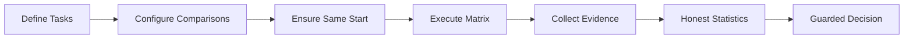
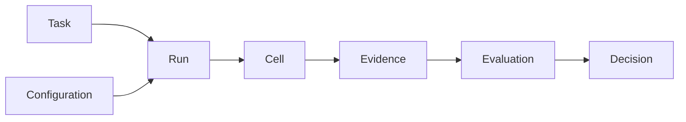

# 设计系统

micro-eval 的所有功能都服务于同一个决策循环。理解这个循环及其设计原则，比死记配置字段更重要。

## 决策循环

micro-eval 的一切都源自一个等式：

> **Run = Tasks × Configurations × Repetitions → ResultMatrix → Decision**

流程中的每一步都有明确职责，缺一不可。

::: warning 为何每一步都至关重要
如果这个循环在任何环节断裂，产品就会退化为"展示结果让用户自己猜"。那就不是决策工具了。
:::

## 三大设计张力

micro-eval 的每个功能都在化解三种张力之一。理解它们，有助于你明白产品为何如此设计。

| 张力 | 对你意味着什么 | 在产品中的体现 |
|---|---|---|
| **Evidence-first（证据优先）** | 每个结论都可以下钻到原始产物。没有产物支撑的分数毫无意义。 | Evidence Chain、结果页的 artifact 链接、Decision 必须引用 Evaluation |
| **Same-start（同起点）** | 在同一个 Task 行内，所有 Configuration 和 Repetition 单元格必须从等价的 workspace 快照出发。不同 Task 行可以使用不同 workspace。 | SameStartSnapshot、workspace 隔离、`not_comparable` 状态 |
| **Honest boundaries（诚实边界）** | "样本量不足，无法判断"是正确答案，不是 bug。工具不应凭空制造它并不具备的置信度。 | 六种 DecisionStatus 值（含 `inconclusive`）、Caveat（警告标记）机制、置信度分级 |

::: tip 张力，不是矛盾
这三个目标偶尔会相互拉扯——更多证据意味着更长的执行时间；更严格的同起点要求可能阻碍快速迭代。micro-eval 选择将这种权衡呈现出来，而不是把它藏起来。
:::

## 核心对象 {#core-objects}

七个对象承载数据流转整个循环，每个对象职责单一、清晰。

| 对象 | 矩阵角色 | 一句话说明 |
|---|---|---|
| **Task** | 行 | 测什么——prompt、workspace 与验收标准。 |
| **Configuration（配置组）** | 列 | 被测的是什么——agent、参数与运行环境。 |
| **Run** | 矩阵本身 | 一次完整的 Tasks × Configs × Reps 执行，产出 ResultMatrix。 |
| **Cell** | 单元格 | 一次原子执行——单个 (task, config, repetition) 的组合。 |
| **Evidence（证据）** | 事实记录 | stdout、diff、成本数据；不可变、已脱敏，并溯源至对应 cell。 |
| **Evaluation（评分）** | 打分判断 | 确定性验证器 → LLM judge → 人工标注，分层叠加应用。 |
| **Decision（决策结论）** | 可操作结论 | `improved` / `regressed` / `inconclusive` 加上任意 Caveat（警告标记）。 |

::: tip 次级对象
以上是核心对象。其他对象——AgentSpec、WorkspaceSpec、RunPlan、Expectation、Caveat——属于次级对象，在配置特定功能时按需接触。
:::

::: info 服务器模式扩展（v0.4）
Team Server 新增了三个位于核心七对象之外的运维层概念：

- **Workspace（工作区）** — 服务器上的隔离评测环境，归属于某个团队成员。逻辑上等价于本地的 `project_root`。
- **Template（模板）** — 共享模板库中的只读配置蓝图。成员基于模板创建工作区。
- **Job（任务队列项）** — 已排队的 run 请求。服务器通过 worker 进程串行执行 Job。

这些是基础设施层的概念。核心决策循环（Task → Configuration → Run → Cell → Evidence → Evaluation → Decision）在服务器模式下保持不变。
:::

## 这些原则对你意味着什么

作为用户，你会遇到四个实际影响：

- **"Inconclusive" 不是 bug。** 如果运行结果报告 `inconclusive`，说明样本量太小，无法得出结论。增加重复次数后重新运行即可。
- **Workspace 漂移会阻断对比。** 如果各配置组的 workspace 状态不一致，结果会被标记为 `not_comparable`。运行前请先 commit 或 stash 本地改动。
- **每个分数都有证据链接。** 你始终可以从 Decision 下钻到产出该分数的原始 artifact。如果做不到，请提 bug。
- **确定性检查优先执行。** 退出码、文件存在性、测试通过等验证器会在任何 LLM 判断之前运行。若确定性检查失败，LLM 评分将被跳过。
