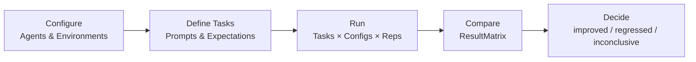

# 什么是 micro-eval？

## 问题所在

小型 AI 团队行动迅速。当两个 agent、prompt 或 skill 配置产生不同输出时，判断哪个更好往往凭借直觉——"这个 _感觉_ 更准确。"在原型阶段这没问题，但一旦需要为某个改动提供依据、复现结果，或将决策移交给他人，这种方式就会失效。

**micro-eval 将"我觉得这个 agent 更强"转化为可追溯、可复现的结论。**

## 解决方案

micro-eval 是一款本地优先的评测工具，它将你的 agent 和 skill 在定义好的任务矩阵上运行，收集结构化结果，并以分数、trace 和 diff 为支撑输出决策结论。你定义"正确"的标准（退出码、输出模式、文件是否存在，或自定义命令），运行矩阵，即可得到可分享、可回溯的对比报告。无需托管服务，无需供应商绑定——只需一个 YAML 配置文件、一个 CLI，以及读取 `.micro-eval/` 目录文件的本地 Web UI。

## 核心工作流

## 核心设计原则

- **本地优先。** 所有数据保存在你机器上的 `.micro-eval/` 目录中，无需账号，无需云同步。
- **以证据支撑决策。** 每个结论都可追溯至产生它的任务、trace、diff 和成本。
- **可复现的起点。** 每次 Run 都会捕获 workspace 状态、repo commit、skill 版本和 sandbox 配置，确保结果可信且可跨时间比较。
- **分层评测。** 确定性验证器优先运行；在确定性无法覆盖的地方，由 LLM judge 和人工标注补充。

## micro-eval 适合谁？

micro-eval 面向 **1–20 人的 AI 小团队**，适用场景包括：

- 对比 agent 配置、skill 版本或模型选择
- 验证 prompt 改动是优化而非退步
- 为自有任务和工作流构建内部基准测试
- 快速迭代，需要轻量、可复现的评测依据

::: tip 无需任何基础设施
micro-eval 完全在你的笔记本上运行，唯一的外部依赖就是你正在评测的 agent。
:::

## micro-eval 不适合做什么

::: warning 超出范围
- **不是公开基准排行榜。** 它评测的是 _你自己_ 的 agent 在 _你自己_ 的任务上的表现，而非标准化公开测试集。
- **不是托管 SaaS。** 没有云后端，没有账号，数据不会离开你的机器。
- **不是生产监控工具。** 它面向离线、有计划的评测周期，而非实时告警。
:::

## 下一步

准备好运行第一次评测了吗？

- [快速上手](/zh/guide/getting-started) — 安装 micro-eval，在 10 分钟内完成第一次对比
